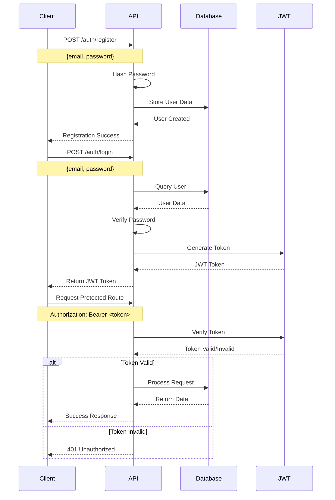

# Awesome Project Built with TypeORM

## Overview

This is a robust application built using TypeORM, providing powerful database management capabilities with TypeScript support.

## Features

- Type-safe database operations
- Support for multiple database systems (MySQL, PostgreSQL, SQLite, etc.)
- Entity relationship management
- Migration system
- Connection pooling
- Query builder
- Caching capabilities
- CLI commands

## Technical Design Flow

### Authentication Flow (Email/Password with JWT)



### Authentication Components

1. **User Registration**

   - Validates email format
   - Enforces password requirements
   - Hashes password using bcrypt
   - Stores user data in database

2. **Login Process**

   - Validates credentials
   - Generates JWT token with:
     - User ID
     - Email
     - Role
     - Expiration time

3. **Token Management**

   - Access token validity: 1 hour
   - Refresh token validity: 7 days
   - Token rotation on refresh
   - Blacklist for revoked tokens

4. **Security Measures**
   - Rate limiting
   - CORS configuration
   - XSS protection
   - CSRF protection

## Installation & Setup

1. Install dependencies:

```bash
bun i
```

2. Configure database settings:

- Open `data-source.ts` file
- Update the following parameters:
  ```typescript
  {
    type: "your-database-type",
    host: "your-host",
    port: your-port,
    username: "your-username",
    password: "your-password",
    database: "your-database-name"
  }
  ```

3. Start the application:

```bash
bun run dev
```

## Usage Examples

### Creating an Entity

```typescript
@Entity()
export class User {
  @PrimaryGeneratedColumn()
  id: number;

  @Column()
  firstName: string;

  @Column()
  lastName: string;
}
```

### Querying Data

```typescript
// Find all users
const users = await userRepository.find();

// Find user by ID
const user = await userRepository.findOne({
  where: { id: 1 },
});
```

### Relationships

```typescript
@Entity()
export class Post {
  @ManyToOne(() => User, user => user.posts)
  author: User;
}
```

### Using Migrations

```bash
# Generate migration
bun run typeorm migration:generate -- -n PostRefactoring

# Run migrations
bun run typeorm migration:run
```

## API Documentation

### Endpoints

- `GET /api/users`: Fetch all users
- `POST /api/users`: Create new user
- `GET /api/users/:id`: Fetch user by ID
- `PUT /api/users/:id`: Update user
- `DELETE /api/users/:id`: Delete user

### Request Examples

```bash
# Create user
curl -X POST http://localhost:3000/api/users \
  -H "Content-Type: application/json" \
  -d '{"firstName": "John", "lastName": "Doe"}'
```

## Error Handling

The application implements robust error handling:

- Database connection errors
- Validation errors
- Authentication errors
- Authorization errors

## Testing

Run tests using:

```bash
bun test
```

## Security Features

- Input validation
- SQL injection prevention
- XSS protection
- Rate limiting
- CORS configuration

## Performance Optimization

- Query optimization
- Indexing strategies
- Caching implementation
- Connection pooling

## Contributing

1. Fork the repository
2. Create your feature branch
3. Commit your changes
4. Push to the branch
5. Create a Pull Request

## License

This project is licensed under the MIT License

## Contact Information

For questions or support, please contact:

Kehinde Fasunle |
[](mailto:kfasunle@gmail.com) |
[](https://www.linkedin.com/in/FasunleKehinde)
